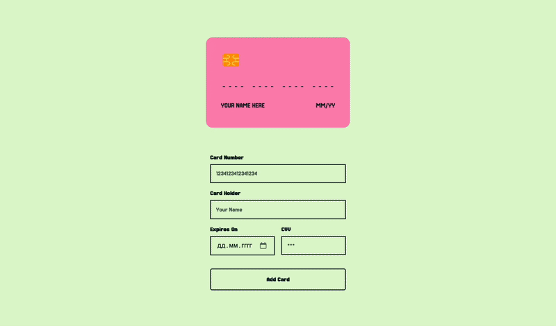

# Card Management System

A modern, interactive card management system built with vanilla JavaScript, featuring a beautiful UI and smooth animations.


### Adding a New Card



## Features

- Interactive credit card form with real-time card preview
- Card type detection (Visa, Mastercard, Amex)
- Card list management with selection and removal
- Add money functionality
- Responsive design for all devices
- Smooth animations and transitions
- Modern, clean UI

# Credit Card Form and List Application

This is a simple web application that demonstrates a credit card form, a list of saved cards, and basic interactions like adding, removing, and selecting cards.

## Project Structure

- `index.html`: The main HTML file that loads the application.
- `src/`:
  - `app.js`: The main application logic, orchestrating component interactions.
  - `components/`: Contains individual UI components (CreditCard, CardForm, CardList, AddMoney).
  - `styles/main.css`: Global styles and responsive design rules.
  - `assets/`: Contains images and icons (e.g., card type logos).
  - `utils/`: Utility functions (currently empty, but can be used for helpers).

## Features

- **Credit Card Display**: Visually represents a credit card with dynamic updates for card number, holder name, expiry date, and CVV.
- **Card Form**: Allows users to input new credit card details with real-time feedback on the card display.
- **Card List**: Displays a list of saved credit cards.
- **Add Card**: Navigates to the card form to add a new card.
- **Remove Card Mode**: Toggles a mode where users can click an 'X' icon on a card in the list to remove it.
- **Add Money**: Select a card and click 'Add Money' to simulate adding funds (currently a placeholder).
- **Responsive Design**: Adapts the layout and elements for optimal viewing on mobile devices.

## How to Run the Project

To run this project locally, you need a simple web server. Here are a few ways:

### Using Node.js (recommended for development)

1.  **Install Node.js**: If you don't have Node.js installed, download it from [nodejs.org](https://nodejs.org/).
2.  **Install `http-server`**: Open your terminal or command prompt and run:
    ```bash
    npm install -g http-server
    ```
3.  **Navigate to the project directory**: In your terminal, `cd` into the `card-form` directory:
    ```bash
    cd /path/to/your/card-form
    ```
4.  **Start the server**: Run the `http-server` command:
    ```bash
    http-server
    ```
5.  **Open in browser**: Open your web browser and go to `http://localhost:8080` (or the address shown in your terminal).

### Using Python's built-in HTTP server

1.  **Navigate to the project directory**: In your terminal, `cd` into the `card-form` directory:
    ```bash
    cd /path/to/your/card-form
    ```
2.  **Start the server**: Run one of the following commands based on your Python version:
    ```bash
    # For Python 3
    python -m http.server
    
    # For Python 2
    python -m SimpleHTTPServer
    ```
3.  **Open in browser**: Open your web browser and go to `http://localhost:8000` (or the address shown in your terminal).

## How to Integrate into Your Project

This project is built using vanilla JavaScript, HTML, and CSS, making it easy to integrate into existing web projects without complex build tools or frameworks.

### Basic Project Setup

1.  **Copy Files**: Copy the `index.html` file and the entire `src/` directory into your project's structure.
2.  **Link CSS**: Ensure your `index.html` (or equivalent main HTML file) links to `src/styles/main.css`:
    ```html
    <link rel="stylesheet" href="src/styles/main.css">
    ```
3.  **Include JavaScript**: Ensure your `index.html` includes `src/app.js` with `type="module"` at the end of the `<body>` tag:
    ```html
    <script type="module" src="src/app.js"></script>
    ```
    *Note: Since `app.js` uses ES Modules (`import`), it must be loaded as a module.*

### Integrating Individual Components

If you wish to integrate individual components (`CreditCard`, `CardForm`, `CardList`, `AddMoney`) into a larger, existing JavaScript application, follow these guidelines:

1.  **Copy Component Files**: Copy the entire `src/components/` directory into your project. You will also need `src/styles/main.css` for component styling and `src/assets/icons/` for card type images.

2.  **HTML Containers**: Each component needs a specific HTML container (a `div` element, for example) in your HTML where it will render its content. Make sure these containers exist in your `index.html` or main application template.

    ```html
    <!-- Example HTML for component containers -->
    <div id="creditCardContainer"></div>
    <div id="cardFormContainer"></div>
    <div id="cardListContainer"></div>
    <div id="addMoneyContainer"></div>
    ```

3.  **Import Components**: In your main JavaScript file (e.g., `main.js` or `app.js` in your project), import the component classes:

    ```javascript
    import { CreditCard } from './path/to/src/components/CreditCard/CreditCard.js';
    import { CardForm } from './path/to/src/components/CardForm/CardForm.js';
    import { CardList } from './path/to/src/components/CardList/CardList.js';
    import { AddMoney } from './path/to/src/components/AddMoney/AddMoney.js';
    ```
    *Adjust `path/to/src/components/` to match the actual relative path in your project structure.*

4.  **Instantiate Components**: Once the DOM is loaded, get references to your HTML containers and instantiate the component classes. The `CardForm` component requires an instance of `CreditCard` to communicate with the card display.

    ```javascript
    document.addEventListener('DOMContentLoaded', () => {
        const creditCardContainer = document.getElementById('creditCardContainer');
        const cardFormContainer = document.getElementById('cardFormContainer');
        const cardListContainer = document.getElementById('cardListContainer');
        const addMoneyContainer = document.getElementById('addMoneyContainer');

        const creditCard = new CreditCard(creditCardContainer);
        const cardForm = new CardForm(cardFormContainer, creditCard);
        const cardList = new CardList(cardListContainer);
        const addMoney = new AddMoney(addMoneyContainer);

        // Initially show the card list
        cardListContainer.classList.remove('hidden');
        creditCardContainer.classList.add('hidden'); // Hide credit card initially if starting with list
        cardFormContainer.classList.add('hidden');
        addMoneyContainer.classList.add('hidden');

        // You might want to implement a central state management or router here
        // to control which component is visible.
        const showComponent = (containerToShow) => {
            [creditCardContainer, cardFormContainer, cardListContainer, addMoneyContainer]
                .forEach(container => container.classList.add('hidden'));
            containerToShow.classList.remove('hidden');

            // Special handling for form and card display (they appear together)
            if (containerToShow === cardFormContainer) {
                creditCardContainer.classList.remove('hidden');
            } else {
                creditCardContainer.classList.add('hidden');
            }
        };

        // Example: showing the card list
        showComponent(cardListContainer);

        // ... attach event listeners from app.js ...
        // These event listeners would now be in your main application logic
        // rather than within a CardApp class, depending on your architecture.
        cardFormContainer.addEventListener('cardFormSubmit', (e) => {
            // Handle new card submission
            const newCardData = e.detail;
            // Add newCardData to your central card data array
            // Then update the cardList component: cardList.setCards(updatedCards);
            showComponent(cardListContainer);
            cardForm.clearForm();
        });

        cardListContainer.addEventListener('addNewCard', () => {
            showComponent(cardFormContainer);
        });

        cardListContainer.addEventListener('cardSelected', (e) => {
            const selected = e.detail;
            creditCard.setCardData(selected);
            // Decide if you want to show addMoney component directly, or wait for another action
            // showComponent(addMoneyContainer); // Example if you want to show AddMoney on select
        });

        cardListContainer.addEventListener('cardDeselected', () => {
            creditCard.clearCard();
        });

        cardListContainer.addEventListener('showAddMoney', (e) => {
            const cardToFund = e.detail;
            addMoney.setCard(cardToFund);
            showComponent(addMoneyContainer);
        });

        cardListContainer.addEventListener('removeCard', (e) => {
            const cardToRemove = e.detail;
            // Remove card from your central data store
            // Then update the cardList component: cardList.setCards(updatedCards);
            showComponent(cardListContainer);
        });

        addMoneyContainer.addEventListener('addMoney', (e) => {
            const { amount, cardId } = e.detail;
            // Handle adding money logic for cardId
            showComponent(cardListContainer);
        });

        addMoneyContainer.addEventListener('backToList', () => {
            showComponent(cardListContainer);
        });
    });
    ```

5.  **Styling**: Ensure your main application's HTML links to `src/styles/main.css` for all the necessary component styling.

    ```html
    <link rel="stylesheet" href="path/to/src/styles/main.css">
    ```
    *Adjust `path/to/src/styles/main.css` to match the actual relative path in your project structure.*

By following these steps, you can integrate each component individually into your custom JavaScript application and manage their interactions based on your project's architecture. 
